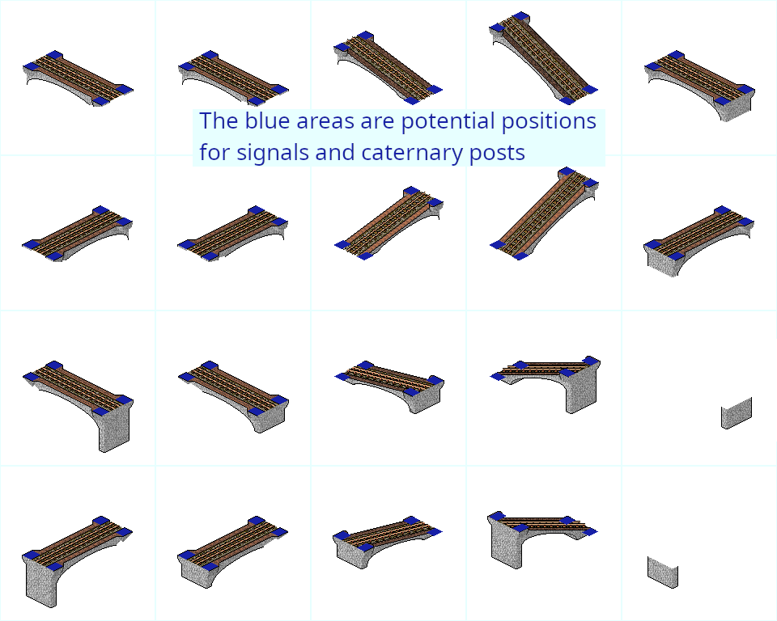

# Narrowgauge track infrastructure

## Bridges

Bridges should distinguish from standard track bridges by using a small structure / being flimsy.
Only at the end of the tile there is some space needed for caternary posts and signals.
Please consider providing them some ground.
The exact spots can be seen here:

